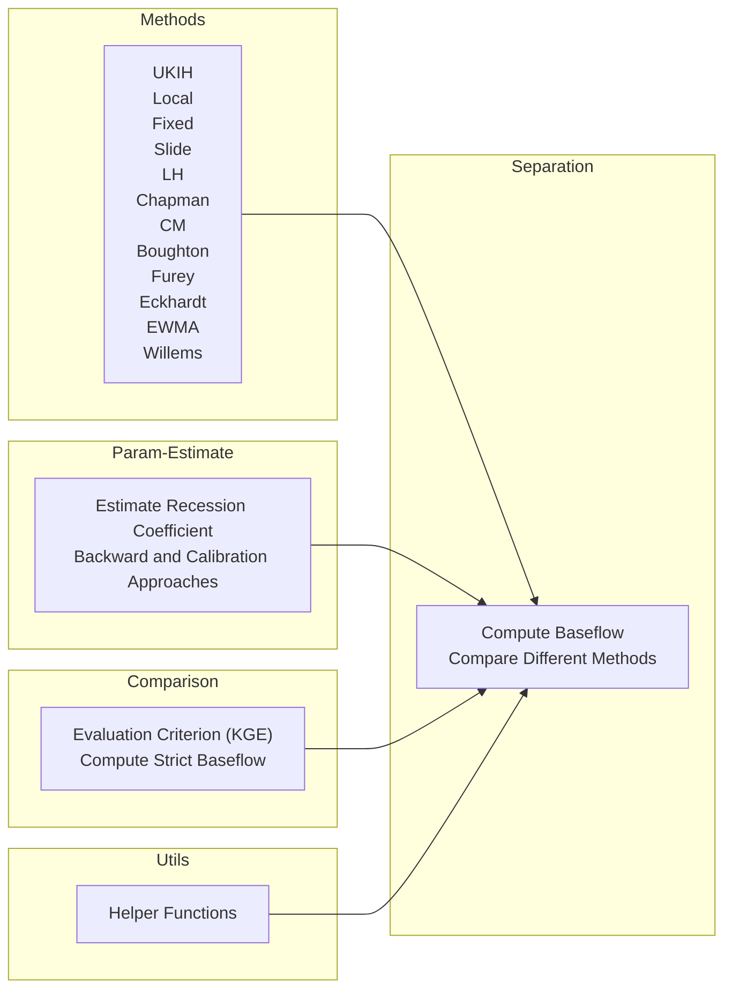

# 🌟 baseflow

baseflow is a Python package that provides a collection of functions for baseflow separation, which is the process of separating the baseflow component from the total streamflow.

This project is funded by [CIROH](https://ciroh.ua.edu/) and aims to extend the functionality of the original baseflow package by adding new features and improvements. Our goal is to continuously enhance and maintain this package, keeping it up-to-date with the latest developments in baseflow separation techniques.

🔥 **Our [GitHub](https://github.com/BYU-Hydroinformatics/baseflow/tree/merge-my-changes)** 🔥

## 🚀 Project Structure

├── methods <- implements for 12 baseflow separation methods  
│    
├── separation <- compute baseflow and compare different separation methods  
│    
├── param_estimate <- estimates recession coefficient & backward and calibration approaches to estimate other parameters   
│  
├── comparison <- an evaluation criterion to compare different
methods (KGE) & compute strict baseflow  
│    
└── utils <- helper functions

## Computation Process

