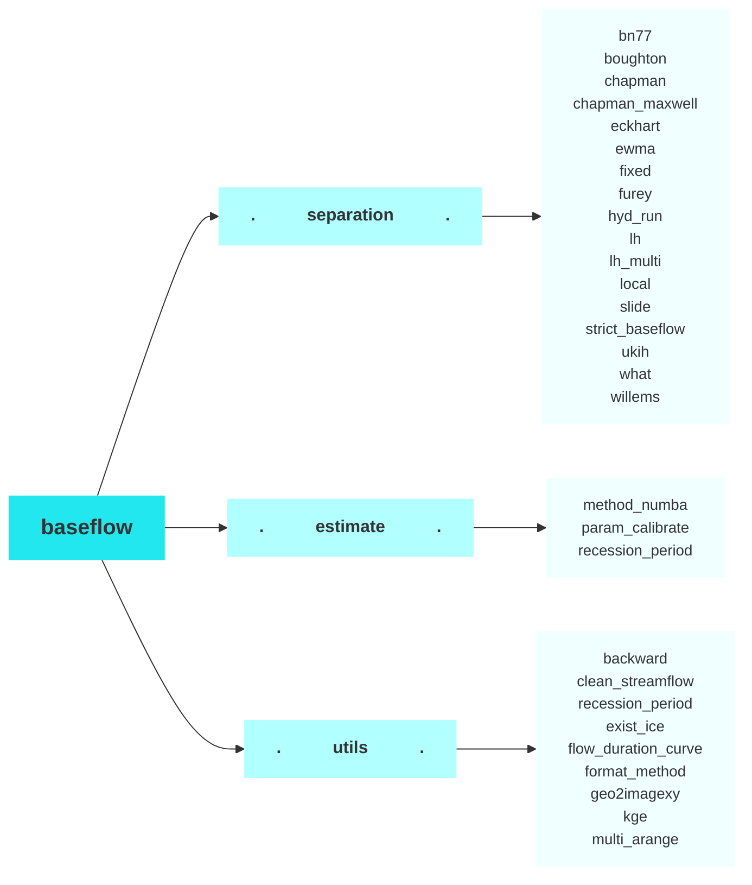

## **baseflow**

baseflow is a Python package designed to facilitate the process of baseflow separation, which involves distinguishing the baseflow component from the total streamflow in hydrological studies. This package provides a comprehensive suite of tools and methods for analyzing streamflow data, making it an essential resource for hydrologists and water resource managers.

***Key Features:***

 - Multiple Baseflow Separation Methods: Implements a variety of baseflow separation techniques.

 - Parameter Calibration: Offers functions for calibrating parameters using flow data, baseflow data, and other relevant parameters, ensuring accurate and reliable separation results.

 - Support for Multiple Stations: Capable of handling flow data from multiple hydrological stations, streamlining the analysis process for large-scale studies or regional assessments.
 - Interactive Notebooks: Provides Colab notebooks for hands-on tutorials and examples, demonstrating the usage of the package for both single and multiple station analyses.
 - Comprehensive Documentation: Detailed documentation and API references, including descriptions of core modules (separation, estimate, utils) and their functions, installation instructions, and practical tutorials.

***Funding and Support:***

This project is funded by ***the Cooperative Institute for Research to Operations in Hydrology (CIROH) ([https://ciroh.ua.edu/](https://ciroh.ua.edu/))*** and developed by the BYU Hydroinformatics Lab at Brigham Young University. This project aims to extend the functionality of the original baseflow package by adding new features and improvements. Our goal is to continuously enhance and maintain this package, keeping it up-to-date with the latest developments in baseflow separation techniques.

***Github link: [https://github.com/BYU-Hydroinformatics/baseflow/](https://github.com/BYU-Hydroinformatics/baseflow/)***

## **BYU Hydroinformatics Lab**
The ***[Brigham Young University](https://www.byu.edu/)*** (BYU) ***Hydroinformatics Lab ([https://hydroinformatics.byu.edu/](https://hydroinformatics.byu.edu/))*** is a dynamic research group within the Department of Civil and Construction Engineering. Our lab focuses on the integration of data science, informatics, and advanced computational techniques with traditional hydrology to address complex water-related challenges. By harnessing the power of big data, machine learning, and cloud computing, we aim to improve the understanding, management, and sustainability of water resources.

At the BYU Hydroinformatics Lab, we are committed to advancing the field of hydrology through innovative research and the development of cutting-edge tools and technologies. Our interdisciplinary approach enables us to collaborate with experts in engineering, computer science, environmental science, and policy to tackle pressing issues such as climate change, water scarcity, and ecosystem preservation.

## **History of the Package**
This project is a continuation and enhancement of the [original baseflow repository](https://github.com/xiejx5/baseflow), which implements various baseflow separation methods. Our project builds upon the foundation laid by [Xie et al. (2020)](https://doi.org/10.1016/j.jhydrol.2020.124628). 

We aim to extend the functionality of the original baseflow package by adding new features and improvements, ensuring it remains up-to-date with the latest developments in baseflow separation techniques.

***Citation***

- *Xie, J., Liu, X., Jasechko, S., Berghuijs, W. R., Wang, K., Liu, C., Reichstein, M., Jung, M., & Koirala, S. (2024). Majority of global river flow sustained by groundwater. Nature Geoscience, 17(8), 770–777. https://doi.org/10.1038/s41561-024-01483-5*
- *Xie, J., Liu, X., Wang, K., Yang, T., Liang, K., & Liu, C. (2020). Evaluation of typical methods for baseflow separation in the contiguous United States. Journal of Hydrology, 583, 124628. https://doi.org/10.1016/j.jhydrol.2020.124628*

## **Documentation Overview**
The baseflow documentation provides comprehensive guides and examples to help you get started with baseflow separation. It includes:

 - Modules: Detailed descriptions of the core modules (separation, estimate, utils) and their functions.
 - API Reference: In-depth API documentation for all available methods and utilities.
 - Examples/Notebooks: Interactive Colab notebooks demonstrating basic and advanced usage, including single and multiple station examples.
 - Installation: Step-by-step instructions for installing the baseflow package and its dependencies.
 - Tutorials: Practical tutorials on using the package for various baseflow separation tasks.

## **Project Structure**

