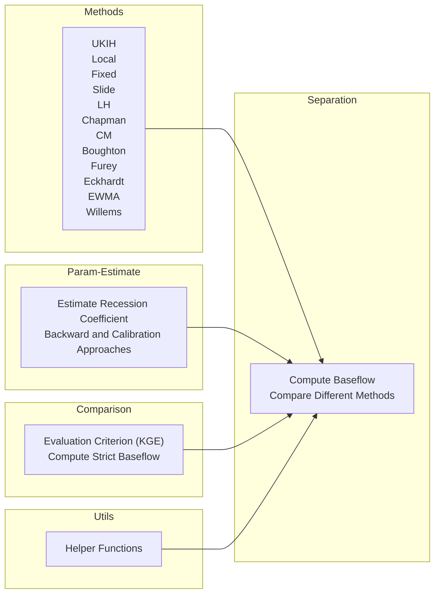

## **baseflow**

baseflow is a Python package that provides a collection of functions for baseflow separation, which is the process of separating the baseflow component from the total streamflow.

This project is funded by ***CIROH ([https://ciroh.ua.edu/](https://ciroh.ua.edu/))*** and aims to extend the functionality of the original baseflow package by adding new features and improvements. Our goal is to continuously enhance and maintain this package, keeping it up-to-date with the latest developments in baseflow separation techniques.

***Github link: [https://github.com/BYU-Hydroinformatics/baseflow/](https://github.com/BYU-Hydroinformatics/baseflow/)***

## **BYU Hydroinformatics Lab**
The ***[Brigham Young University](https://www.byu.edu/)*** (BYU) ***Hydroinformatics Lab ([https://hydroinformatics.byu.edu/](https://hydroinformatics.byu.edu/))*** is a dynamic research group within the Department of Civil and Construction Engineering. Our lab focuses on the integration of data science, informatics, and advanced computational techniques with traditional hydrology to address complex water-related challenges. By harnessing the power of big data, machine learning, and cloud computing, we aim to improve the understanding, management, and sustainability of water resources.

At the BYU Hydroinformatics Lab, we are committed to advancing the field of hydrology through innovative research and the development of cutting-edge tools and technologies. Our interdisciplinary approach enables us to collaborate with experts in engineering, computer science, environmental science, and policy to tackle pressing issues such as climate change, water scarcity, and ecosystem preservation.

## **Documentation Overview**
The baseflow documentation provides comprehensive guides and examples to help you get started with baseflow separation. It includes:

 - Modules: Detailed descriptions of the core modules (separation, estimate, utils) and their functions.
 - API Reference: In-depth API documentation for all available methods and utilities.
 - Examples/Notebooks: Interactive Colab notebooks demonstrating basic and advanced usage, including single and multiple station examples.
 - Installation: Step-by-step instructions for installing the baseflow package and its dependencies.
 - Tutorials: Practical tutorials on using the package for various baseflow separation tasks.

Explore the documentation to leverage the full potential of the baseflow package!
## **Project Structure**

```mermaid
graph TB
    style A fill:#f9f,stroke:#333,stroke-width:4px;
    style B fill:#bbf,stroke:#333,stroke-width:2px;
    style C fill:#bbf,stroke:#333,stroke-width:2px;
    style D fill:#bbf,stroke:#333,stroke-width:2px;
    style E fill:#bbf,stroke:#333,stroke-width:2px;
    style F fill:#bbf,stroke:#333,stroke-width:2px;
    style G fill:#bbf,stroke:#333,stroke-width:2px;
    style H fill:#bbf,stroke:#333,stroke-width:2px;
    style I fill:#bbf,stroke:#333,stroke-width:2px;
    style J fill:#bbf,stroke:#333,stroke-width:2px;

    A[baseflow] --> B[methods]
    A --> C[separation]
    A --> D[param_estimate]
    A --> E[comparison]
    A --> F[utils]
    A --> G[docs]
    A --> H[README.md]
    A --> I[setup.py]
    A --> J[requirements.txt]

    B --> B1[Boughton.py]
    B --> B2[Chapman.py]
    B --> B3[CM.py]
    B --> B4[Eckhardt.py]
    B --> B5[EWMA.py]
    B --> B6[Fixed.py]
    B --> B7[Furey.py]
    B --> B8[LH.py]
    B --> B9[Local.py]
    B --> B10[Slide.py]
    B --> B11[UKIH.py]
    B --> B12[Willems.py]

    C --> C1[separation.py]

    D --> D1[param_estimate.py]

    E --> E1[comparison.py]

    F --> F1[utils.py]

    G --> G1[index.md]
    G --> G2[instructions.md]

```

## **Computation Process**

